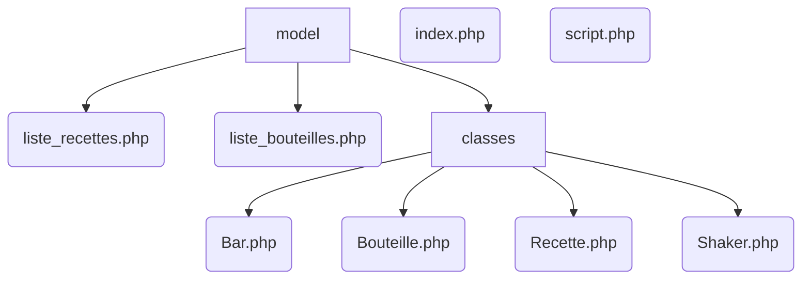

# BeBar
> Programme de modélisation d'un Bar (en POO)

## Auteurs
Diane & MTP6

## Technologies

| HTML | PHP |
|:--:|:--:|

# Architecture

# Fonctionnement
> Script PHP d'application de POO et des principes du MVC
* Le bar propose des recettes de cocktail et contient des bouteilles
* Le shaker permet d'effectuer des cocktails