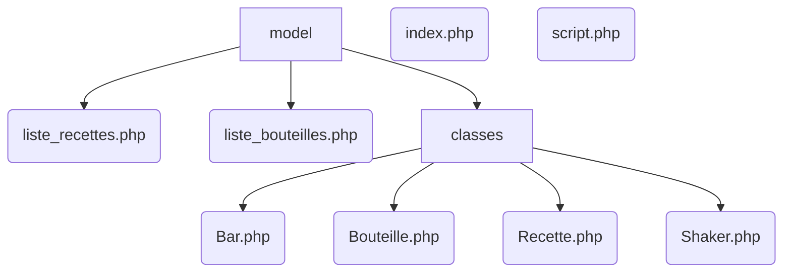
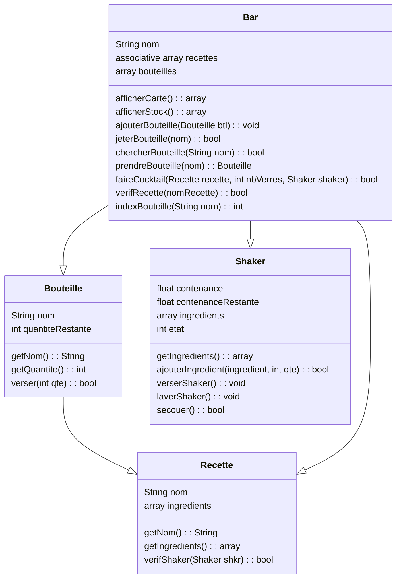

# BeBar
> Programme de modélisation d'un Bar (en POO)

## Auteurs
Diane & MTP6

## Technologies

| HTML | PHP |
|:--:|:--:|

# Architecture

```mermaid
graph TD;
    A[model]--> I(liste_recettes.php)
    A[model]--> J(liste_bouteilles.php)
    A --> B[classes]
    B --> E(Bar.php)
    B --> F(Bouteille.php)
    B --> G(Recette.php)
    B --> H(Shaker.php)
    C(index.php)
    D(script.php)
```

## Model

```mermaid
classDiagram
    Bouteille --|> Recette
    Bar --|> Bouteille
    Bar --|> Recette
    Bar --|> Shaker
    class Bar {
        String nom
        associative array recettes
        array bouteilles
        afficherCarte() : array
        afficherStock() : array
        ajouterBouteille(Bouteille btl) : void
        jeterBouteille(nom) : bool
        chercherBouteille(String nom) : bool
        prendreBouteille(nom) : Bouteille
        faireCocktail(Recette recette, int nbVerres, Shaker shaker) : bool
        verifRecette(nomRecette) : bool
        indexBouteille(String nom) : int
    }
    class Bouteille {
        String nom
        int quantiteRestante
        getNom() : String
        getQuantite() : int
        verser(int qte) : bool
    }
    class Recette {
        String nom
        array ingredients
        getNom() : String
        getIngredients() : array
        verifShaker(Shaker shkr) : bool
    }
    class Shaker {
        float contenance
        float contenanceRestante
        array ingredients
        int etat
        getIngredients() : array
        ajouterIngredient(ingredient, int qte) : bool
        verserShaker() : void
        laverShaker() : void
        secouer() : bool
    }
```